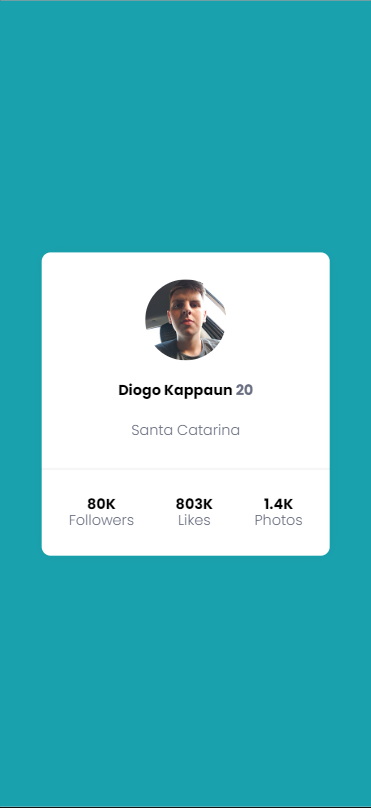
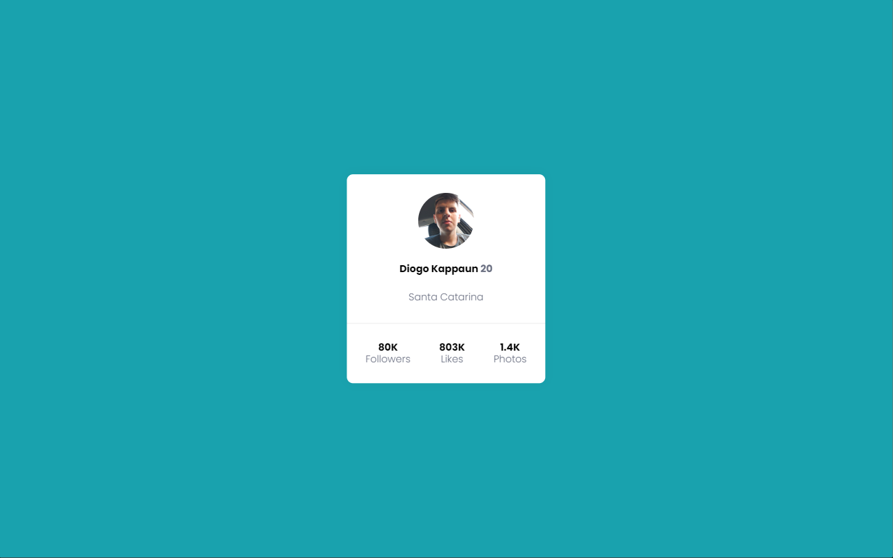

# Projeto Cartão de Perfil




## Tecnologias utilizadas
- HTML5
- CSS3

## Como utilizar

1 - Clone do projeto
```
git clone <url>
```
2 - Acesse a pasta do projeto
```
cd profile-card
```
3 - Acesse o VScode
```
code .
